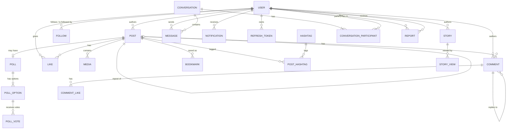

# Database Schema

Source of truth: [`apps/api/prisma/schema.prisma`](../apps/api/prisma/schema.prisma). This document explains the *why* behind the schema; the `.prisma` file is always the accurate *what*.

## Entity relationship diagram



*(Full diagram omits some junction/self-relations for readability — see the schema file for the complete set, including `Block`, `Mute`, and `PostMention`.)*

## Design decisions

**UUIDs over auto-increment integers.** Every primary key is a UUID generated by the Prisma client (`@default(uuid())`), not a DB sequence. This avoids leaking record counts/growth rate through IDs (e.g. a competitor scraping sequential post IDs to estimate your DAU) and makes IDs safe to expose directly in URLs.

**Soft deletes on `Post` and `Comment`.** These use a nullable `deletedAt` instead of a hard `DELETE`, because likes/comments/analytics reference them — hard-deleting would either cascade-destroy engagement history or orphan it. Every query against posts/comments in the service layer must filter `deletedAt: null`; this is enforced at the Prisma query layer in Phase 5/6, not the DB layer, since Postgres row-level soft-delete filtering isn't automatic.

**Reactions modeled as `(postId, userId, emoji)` unique, not a single boolean like.** This supports the brief's "emoji reactions" requirement without a schema migration later — a "like" is just the default `❤️` emoji.

**Repost via self-relation (`Post.originalPostId`).** A repost is a `Post` row pointing back at the original via `onDelete: SetNull` — if the original is deleted, the repost survives as an orphaned repost rather than being destroyed, matching how Twitter/X repost semantics behave.

**Follows/Blocks/Mutes are separate tables, not flags on `User`.** Each is a many-to-many self-relation on `User` via its own join table with a compound unique constraint (e.g. `@@unique([followerId, followingId])`). This is what lets us cheaply answer "who follows X" and "who does X follow" as indexed queries in both directions.

**Refresh tokens, email-verification tokens, and password-reset tokens are DB rows, not JWT-only.** Explained in the Phase 2 notes above — this is what makes server-side session revocation and single-use links possible.

**Indexes follow query patterns, not just foreign keys.** Beyond the FK indexes Prisma needs for relations, composite indexes were added for the access patterns the API will actually run:
| Table | Index | Query it serves |
|---|---|---|
| `posts` | `(authorId, createdAt)` | Profile timeline, newest-first |
| `comments` | `(postId, createdAt)` | Comment thread, newest-first |
| `messages` | `(conversationId, createdAt)` | Chat history pagination |
| `notifications` | `(recipientId, isRead)`, `(recipientId, createdAt)` | Unread badge count; notification feed |
| `stories` | `(authorId, expiresAt)` | "This user's active stories" |

**Cascades.** Deleting a `User` cascades to everything they own (posts, comments, likes, sessions...) — a full account deletion should leave no orphaned rows. Deleting a `Post` cascades to its media/comments/likes/polls but *not* to reposts of it (see above).

**Moderation audit trail (`Report.reviewerId`/`actionTaken`/`reviewNote`, `User.banReason`/`bannedAt`, added Phase 13).** A resolved report and a banned account both record *who* acted and *why*, not just the resulting boolean state — `reviewerId` uses `onDelete: SetNull` so a deleted admin account doesn't take the audit history down with it.

## Running migrations

This schema is designed but has not been executed against a live database in this environment (no network/DB access in the build sandbox). To generate the initial migration:

```bash
cd apps/api
cp .env.example .env   # fill in DATABASE_URL / DIRECT_URL
npm run prisma:migrate -- --name init
```

This creates `apps/api/prisma/migrations/<timestamp>_init/migration.sql` from the schema above and applies it. From then on, any schema change + `npm run prisma:migrate -- --name <description>` generates an incremental migration — never hand-edit `schema.prisma` and expect the DB to follow without running this.

### Advanced constraints beyond Prisma's schema language

A few production-grade constraints aren't expressible directly in `schema.prisma` (Prisma doesn't yet support arbitrary `CHECK` constraints in the schema file) and should be added by hand to the generated migration SQL before applying it, using `prisma migrate dev --create-only` to inspect first:
- `CHECK (expires_at > created_at)` on `polls` and `stories`
- `CHECK (char_length(content) <= 10000)` on `posts.content` as a hard ceiling, in addition to the app-level validation

## Seeding

```bash
npm run prisma:seed
```

Generates 20 users, ~100 posts with random media/likes/comments, and follow relationships, using `@faker-js/faker`. Logs in as `demo@connecthub.dev` / `demo` with password `Password123` for quick manual testing.
